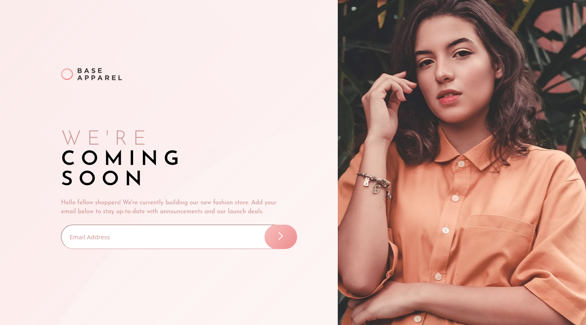
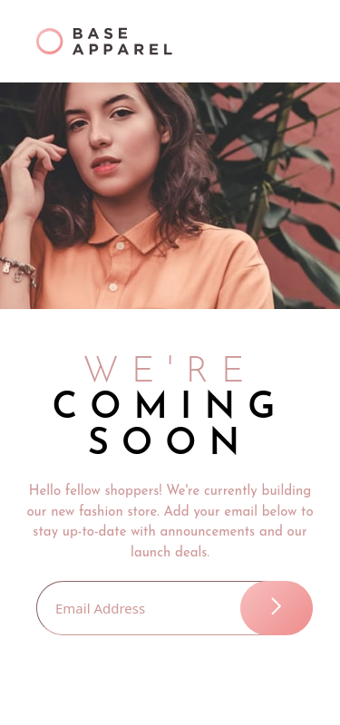

# Frontend Mentor - Base Apparel coming soon page solution

This is a solution to the [Base Apparel coming soon page challenge on Frontend Mentor](https://www.frontendmentor.io/challenges/base-apparel-coming-soon-page-5d46b47f8db8a7063f9331a0). Frontend Mentor challenges help you improve your coding skills by building realistic projects.

## Table of contents

- [Overview](#overview)
  - [Screenshot](#screenshot)
  - [Links](#links)
- [My process](#my-process)
  - [Built with](#built-with)
- [Author](#author)

## Overview

### Screenshot

### Desktop

#### Mobile

### Links

- Solution URL: [GitHub](https://github.com/MoDev228/base-apparel-coming-soon-page)
- Live Site URL: [Name site](https://g-akca.github.io/base-apparel-coming-soon-page/)

## My process

### Built with

- Semantic HTML5 markup
- SASS / SCSS
- Flexbox
- Mobile-first workflow

## Author

- GitHub - [@MoDev228](https://github.com/MoDev228)
- Frontend Mentor - [@MoDev228](https://www.frontendmentor.io/profile/MoDev228)
